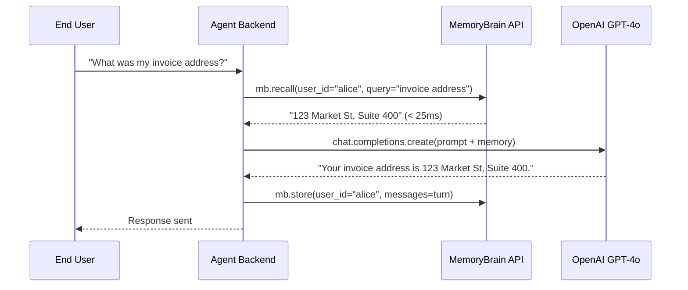

## Overview

By default, OpenAI Chat Completions and Assistant threads forget everything once a session concludes. MemoryBrain acts as a persistent layer outside the thread context window, retrieving only relevant user memories on demand.

## Architecture Pattern



---

## Complete Python Implementation

```python
import os
from openai import OpenAI
from memorybrain import MemoryBrain

openai = OpenAI(api_key=os.environ["OPENAI_API_KEY"])
mb = MemoryBrain(api_key=os.environ["MEMORYBRAIN_API_KEY"])

def chat_with_agent(user_id: str, message: str) -> str:
    # 1. Recall prior memories related to the current message
    memory_result = mb.recall(user_id=user_id, query=message, limit=5)
    memory_context = memory_result.get("context", "")

    # 2. Build system instructions with injected memory context
    system_prompt = (
        "You are an intelligent executive assistant. "
        "Use the retrieved memory context below when answering the user.\n\n"
        f"### Retreived User Memory Context:\n{memory_context}"
    )

    # 3. Request LLM response
    response = openai.chat.completions.create(
        model="gpt-4o",
        messages=[
            {"role": "system", "content": system_prompt},
            {"role": "user", "content": message}
        ],
        temperature=0.3
    )
    answer = response.choices[0].message.content

    # 4. Asynchronously commit conversation turns to MemoryBrain
    mb.store(
        user_id=user_id,
        messages=[
            {"role": "user", "content": message},
            {"role": "assistant", "content": answer}
        ]
    )

    return answer


if __name__ == "__main__":
    uid = "founder_david"
    print(chat_with_agent(uid, "Remember that our Q3 revenue target is $1.2M."))
    print(chat_with_agent(uid, "What is our target for next quarter?"))
```

## Benefits Over Raw Thread Storage
1. **Token Efficiency**: Instead of sending 50k tokens of conversation history on every API turn, MemoryBrain injects < 300 tokens of high-precision context, saving over 90% in inference costs.
2. **Conflict Resolution**: If the user updates their Q3 target from $1.2M to $1.5M, MemoryBrain automatically supersedes the old value.
